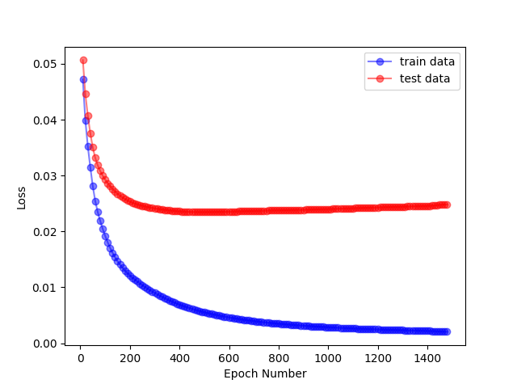

# Handwritten Digit Recognition on Persian(Farsi) MNIST Dataset

## In this project i implemented MLP network using pytorch and train it on Perian MNIST dataset.

## :hammer: Libraries used 

- [PyTorch](https://pytorch.org/)
- [OpenCV](https://opencv.org/)
- [Scikit-Learn](https://scikit-learn.org/stable/)
- [Matplotlib](https://matplotlib.org/)

## :chart_with_upwards_trend: Dataset
I uses persian digit handwritten dataset like [MNIST](http://yann.lecun.com/exdb/mnist/). You can find [here](https://github.com/rezaAdinepour/Persian-Handwritten-Digit-Recognition/tree/main/bmp)

## :key: Neural Network
MLP network is used for this implementation. find MLP class in this file: <code>mlp.py</code>


## :bulb: Working
After cloning the repository, run <code>mlp_classification_letters.py</code> on your IDE or open terminal and write following command:
```
$ python3 mlp_classification_letters.py
```

## :floppy_disk: Results
You can see result of thid cod in following picture:



## License
This project is licensed under the [MIT License](https://github.com/rezaAdinepour/Persian-Handwritten-Digit-Recognition/blob/main/LICENSE).

